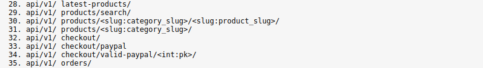
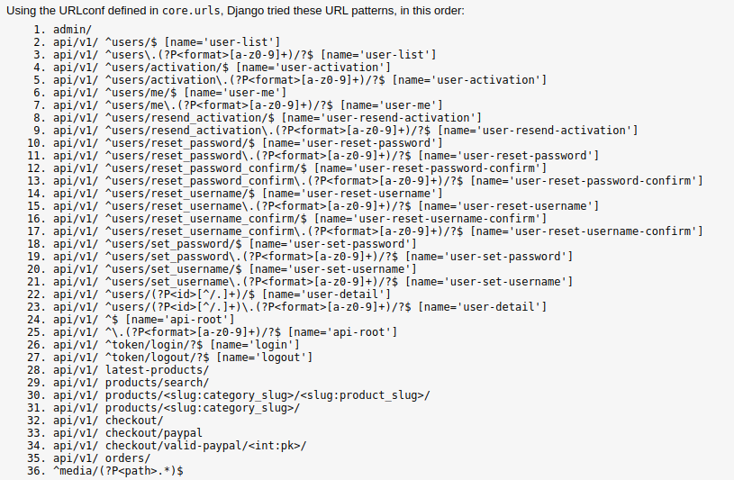

### e-com in django and vuejs

##### for look the project django an d vue integre:
  https://ecom-present.netlify.app/

## You can also find the api online with the link:
  https://api-ecom-pre.herokuapp.com/
  
#### Here are the main addresses to add to access the different part of the API
example:
	https://api-ecom-pre.herokuapp.com/api/v1/latest-products/

  
 
#### and the rest, 
	as important especially for the login even if the one if only needs a link to redirect it where it is necessary
  
 
#### vuejs is in a here depositorie : https://github.com/Yaacov-Zerrad/vuejs-ecom

in this project you will be able to find a rest api with django rest framework for an e-commerce the change will be easy it uses you can use any means of payment because it is at the front to send the data

in my project I will add a customuser system that can be found in my other e-com repositories for example.
I also want to add task automation by installing an Excel recovery system to save products without having to type them one by one

